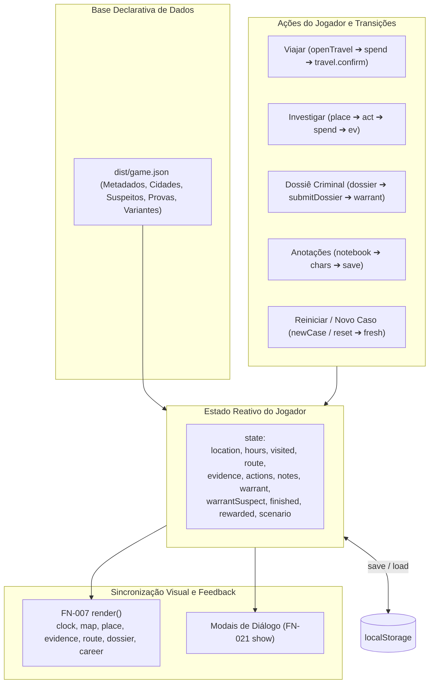

# Relatório Completo: Mapeamento de Funções, Isolamento de Impacto e Guia de Extensibilidade

**Projeto:** Arquivo Zero — Caçada Digital (`Tito`)  
**Repositório:** `/home/elzobrito/desenvolvimento/Tito`  
**Tarefa Governança ESAA:** `TITO-MODULARITY-MAP-001`  
**Data:** 14 de setembro de 2026  
**Status:** Concluído e Verificado (`verify_status: ok`)  
**Arquivo do Motor:** [`dist/app.js`](file:///home/elzobrito/desenvolvimento/Tito/dist/app.js) (`SHA-256: ff025aa8c9d796836a98fa2b4949af504234647a4f36d7a6a57bf3cce285588c`)  
**Arquivo de Dados:** [`dist/game.json`](file:///home/elzobrito/desenvolvimento/Tito/dist/game.json) (`SHA-256: c830b4278e3beac7aa4ef53f06aa5d8e788adfd351fc86c8f615e45a6c113063`)  

---

## 1. Visão Geral

Este documento contém o **mapeamento exaustivo e cirúrgico de todas as 61 funções e callbacks** do motor do jogo *Arquivo Zero*, estabelecendo a arquitetura de isolamento necessária para:
1. **Alterar ou refatorar qualquer função** sem quebrar a jogabilidade ou gerar regressões imperceptíveis para o jogador.
2. **Adicionar novas funcionalidades** (ex.: efeitos sonoros, minigames investigativos, novos atributos de suspeitos, inventário).
3. **Remover funcionalidades existentes** (ex.: ambientação Three.js, caderno de notas, estrelas de carreira) de forma limpa.
4. **Garantir as 6 invariantes críticas** da mecânica investigativa (orçamento de tempo, alcance geográfico, segredo probatório, mandado unívoco, captura válida e estabilidade de sessão).

---

## 2. Arquitetura e Ciclo de Vida do Estado

O jogo opera segundo uma arquitetura **reativa orientada a dados** (*data-driven*), na qual `game.json` dita as regras e o conteúdo, e `state` reflete o progresso do jogador persistido no `localStorage`.



---

## 3. As 6 Invariantes Críticas de Jogabilidade

Nenhuma alteração de código pode violar estas regras fundamentais:

| Invariante | Definição | Ponto Crítico | Risco se Violada |
| :--- | :--- | :--- | :--- |
| **INV-1: Orçamento Temporal** | `0 <= hours <= total_hours`. Se `hours == 0` sem prisão válida, derrota compulsória. | `FN-015 (spend)`, `FN-014 (act)` | Investigação infinita ou travamento sem horas. |
| **INV-2: Topologia e Alcance** | Só viaja para destinos vizinhos no grafo `navigation[state.location]`. | `FN-009 (map)`, `FN-013 (openTravel)` | Pulo indevido de cidades quebrando rotas e pistas. |
| **INV-3: Revelação Progressiva** | Cidades e evidências não descobertas não existem no DOM; contadores não revelam total oculto. | `FN-009`, `FN-011`, `FN-012`, `FN-016` | Jogador descobre o final inspecionando o DOM. |
| **INV-4: Unicidade do Mandado** | Mandado só é emitido se o cruzamento de atributos resultar em **exatamente 1** suspeito. | `FN-017 (submitDossier)` | Mandados ambíguos ou falsos positivos. |
| **INV-5: Validação da Captura** | Vitória requer cumulativamente: mandado contra o culpado real + quantidade mínima de provas + todas as provas essenciais. | `FN-014 (act)`, `CB-016` | Vitória com provas insuficientes ou mandado errado. |
| **INV-6: Estabilidade de Sessão** | Variante do caso (`state.scenario`) persiste em recargas; reiniciar evita repetição imediata. | `FN-002`, `FN-003`, `FN-027` | Rota mudar magicamente ao recarregar o navegador. |

---

## 4. Mapeamento Completo das 61 Unidades Executáveis

### 4.1. Subsistema 1: Bootstrap, Carregamento, Persistência e Variantes
- **`FN-001` (`$`)**: Wrapper de seleção DOM `document.querySelector`.
- **`FN-002` (`loadGame`)**: Carga assíncrona, validação do JSON, recuperação de estado ou criação de nova partida, migração de cenário e acionamento do `render()`.
- **`FN-003` (`fresh`)**: Construtor do estado inicial imutável do caso.
- **`FN-004` (`save`)**: Serialização atômica do `state` no `localStorage`.
- **`FN-027` (`pickScenario`)**: Sorteador pseudo-aleatório de variantes de pistas com exclusão do cenário imediatamente anterior.
- **`FN-028` (`scenario`)**: Resolvedor da variante ativa correspondente a `state.scenario`.
- **`FN-029` (`actionData`)**: Projeção de ação investigativa mesclando *overrides* de cenário sobre a ação base.
- **`CB-001` (`loadGame.parseResponse`)**: Parser de resposta HTTP como JSON.
- **`CB-031` (`json-input.onchange`)**: Handler de upload de casos alternativos via File API.

### 4.2. Subsistema 2: Resolução de Entidades
- **`FN-005` (`loc`)**: Localizador de localização por ID (`state.location` como padrão).
- **`FN-006` (`ev`)**: Localizador de evidência com substituições textuais do cenário ativo.
- **`CB-002` (`loc.match`)**: Predicado de busca de localização.
- **`CB-003` (`ev.match`)**: Predicado de busca de evidência.

### 4.3. Subsistema 3: Deslocamento, Navegação e Orçamento Temporal
- **`FN-008` (`clock`)**: Renderizador do visor de horas, barra proporcional e alerta crítico (`<= 16h`).
- **`FN-009` (`map`)**: Renderizador de cidades acessíveis no mapa e projeção da rota percorrida em SVG.
- **`FN-012` (`route`)**: Renderizador da contagem de cidades visitadas e histórico cronológico.
- **`FN-013` (`openTravel`)**: Preparador do diálogo de confirmação de viagem (`#travel-dialog`).
- **`FN-015` (`spend`)**: Transação central de horas com detecção de encerramento por prazo esgotado.
- **`CB-004` (`map.renderCity`)**: Template HTML de botão de cidade acessível.
- **`CB-005` e `CB-006` (`map.bindCity` / `onCityClick`)**: Vinculadores de clique nas cidades disponíveis.
- **`CB-007` e `CB-008` (`map.resolveRouteLocation` / `projectRoutePoint`)**: Mapeamento e projeção geométrica para SVG.
- **`CB-013` (`route.renderItem`)**: Template HTML de item da rota percorrida.
- **`CB-014` (`travel.confirm`)**: Handler do botão de confirmação de viagem.

### 4.4. Subsistema 4: Investigação e Coleta de Provas
- **`FN-010` (`place`)**: Renderizador da cidade atual, contexto educativo e botões de investigação.
- **`FN-011` (`evidence`)**: Renderizador do mural de provas catalogadas (com *empty state* seguro).
- **`FN-014` (`act`)**: Execução de ação: consome horas via `spend()`, admite evidências e avalia prisão/vitória/derrota.
- **`CB-009`, `CB-010`, `CB-011`**: Projeção HTML, vinculação e despacho de clique das ações investigativas.
- **`CB-012` (`evidence.renderItem`)**: Template HTML de card de prova catalogada.
- **`CB-015` e `CB-016`**: Localização de ação na cidade e checagem de provas obrigatórias.

### 4.5. Subsistema 5: Dossiê e Mandado de Prisão
- **`FN-016` (`dossier`)**: Renderizador do formulário dinâmico a partir de `game.dossier.fields`.
- **`FN-017` (`submitDossier`)**: Motor de inferência criminal. Filtra suspeitos e emite mandado exclusivo.
- **`CB-017` e `CB-018`**: Projeção de campos e opções do formulário.
- **`CB-019`, `CB-020`, `CB-021`, `CB-022`**: Filtragem de campos preenchidos, correspondência e extração de nomes.

### 4.6. Subsistema 6: Apresentação, Modais, Ambientação e Carreira
- **`FN-007` (`render`)**: Orquestrador mestre de sincronização visual da interface.
- **`FN-018` (`career`)**: Renderizador das estrelas de carreira acumuladas.
- **`FN-019` (`awardStar`)**: Incrementador idempotente de estrelas após vitória.
- **`FN-020` (`newCase`)**: Reinicializador de nova partida com alternância de cenário.
- **`FN-021` (`show`)**: Exibidor universal de caixas de diálogo modais (`#message-dialog`).
- **`FN-022` (`escape`)**: Sanitizador seguro de HTML contra XSS.
- **`FN-023` (`closeAll`)**: Fechador em lote de elementos `dialog[open]`.
- **`FN-024` (`chars`)**: Contador de caracteres do caderno de notas.
- **`FN-025` e `FN-026` (`scene` / `animate`)**: Inicializador e loop WebGL Three.js.
- **`CB-023` a `CB-030`, `CB-032`**: Callbacks de modais, injeção de estilo/markup, auto-save de notas e reset.

---

## 5. Guia de Extensibilidade: Como Adicionar e Remover Funcionalidades

### 5.1. Como Adicionar Funcionalidades
1. **Áudio e Efeitos Sonoros (SFX / BGM):**
   - Criar módulo `AudioFX` desacoplado com métodos `play(cue)`.
   - Ligar chamadas nos pontos consolidados de transição: `CB-014` (viagem), `FN-014` (pista/vitória), `FN-015` (derrota).
   - Proteger com `try/catch` para que falhas de áudio ou bloqueio de autoplay jamais impeçam o fluxo do jogo.
2. **Minigame Investigativo (Hacking / Decodificação):**
   - Interceptar `FN-014 (act)` antes de `state.evidence.push()`.
   - Se a ação tiver propriedade `minigame`, abrir diálogo do minigame e admitir a evidência apenas após resolução.
3. **Novos Atributos de Suspeitos:**
   - **Zero linhas de JavaScript necessárias!**
   - Adicionar o novo campo em `dist/game.json` dentro de `dossier.fields` e preencher os valores nos suspeitos. `FN-016` e `FN-017` constroem os campos e filtram dinamicamente via `FormData`.

### 5.2. Como Remover Funcionalidades
1. **Remover Three.js (WebGL):**
   - Reduzir `scene()` a um no-op vazio: `async function scene() {}`.
   - Ocultar `<canvas id="scene">`. Zero impacto na jogabilidade.
2. **Remover Caderno de Notas:**
   - Retirar chamada `chars()` de `render()`.
   - Remover botão e diálogo de notas no HTML.
   - Proteger listener com `if (el.notebook)` e manter `notes: ""` em `fresh()` para compatibilidade com saves antigos.
3. **Remover Sistema de Estrelas de Carreira:**
   - Retirar chamadas `career()` de `render()` e `awardStar()` de `act()`.
   - Remover injeções CSS/HTML `CB-025` e `CB-026`.

---

## 6. Verificações Automatizadas de Não-Regressão

```bash
# 1. Valida paridade de 100% das 61 funções no mapa canônico
node scripts/verify-function-map.mjs

# 2. Valida as 3 variantes, rotas intermediárias e regras probatórias
node scripts/verify-random-scenarios.mjs

# 3. Valida sintaxe JavaScript nativa
node --check dist/app.js

# 4. Valida estrutura do arquivo JSON do caso
jq empty dist/game.json

# 5. Valida a integridade da base determinística ESAA
python3 -m esaa verify
```
