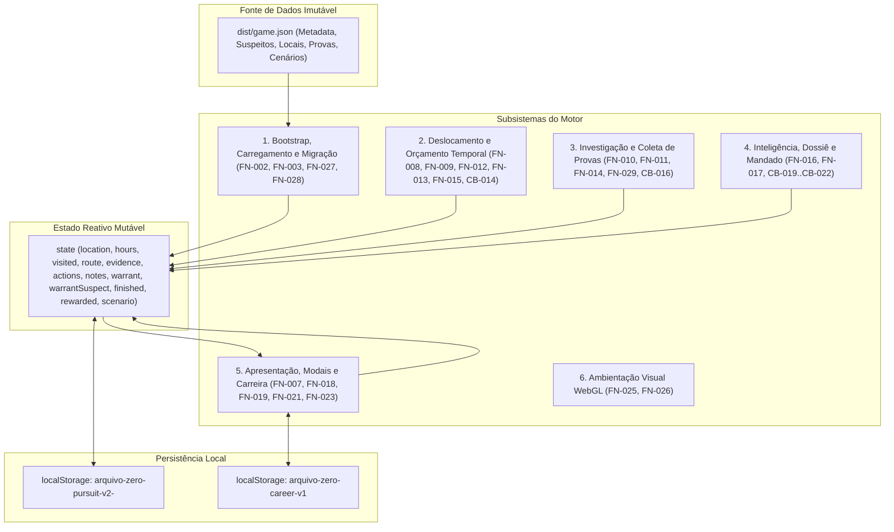

# Mapeamento Aprofundado, Isolamento Funcional e Arquitetura de Extensibilidade
**Projeto:** Arquivo Zero — Caçada Digital (`Tito`)  
**Tarefa de Governança:** `TITO-MODULARITY-MAP-001`  
**Data de Execução:** 2026-09-14  
**Linha de Base do Motor:** `dist/app.js` (SHA-256: `ff025aa8c9d796836a98fa2b4949af504234647a4f36d7a6a57bf3cce285588c`)  
**Contrato de Dados:** `dist/game.json` (SHA-256: `c830b4278e3beac7aa4ef53f06aa5d8e788adfd351fc86c8f615e45a6c113063`)  

---

## 1. Sumário Executivo e Objetivos Arquiteturais

Este documento consolida o mapeamento exaustivo e cirúrgico de **100% das 61 unidades executáveis** (28 funções nomeadas/expressões e 33 arrow functions/callbacks) do motor do jogo *Arquivo Zero*, localizado em `dist/app.js`.

O objetivo primário desta arquitetura é estabelecer uma **fronteira de desacoplamento e isolamento de impacto** que permita:
1. **Modificar qualquer função existente** sem gerar regressões imperceptíveis ou quebras na experiência e na lógica de progressão do jogador.
2. **Adicionar novas funcionalidades** (tais como sonorização/SFX, minigames de hacking, novos atributos de dossiê ou inventário) por meio de pontos de extensão claros e contratos bem definidos.
3. **Remover funcionalidades existentes** (como a ambientação 3D Three.js, o caderno de notas ou o sistema de carreira) de forma limpa, previsível e sem efeitos colaterais residuais no loop principal.
4. **Preservar as 6 invariantes críticas da jogabilidade**, assegurando que tempo, navegação, revelação progressiva, mandado e regras de captura permaneçam matematicamente e legalmente íntegros.

---

## 2. Visão Sistêmica e Arquitetura de Estados

O motor opera segundo um modelo reativo orientado a dados (*data-driven*), no qual toda mutação de estado desencadeia a persistência local e a sincronização visual da interface.



---

## 3. As 6 Invariantes Críticas da Jogabilidade

Para que qualquer modificação seja segura, as seguintes seis invariantes de domínio jamais podem ser violadas:

| # | Invariante | Definição Formal | Ponto Crítico no Código | Risco se Violada |
|---|---|---|---|---|
| **INV-1** | **Orçamento Temporal** | `0 <= state.hours <= metadata.total_hours`. Se `hours == 0` e a ação não for prisão válida, `state.finished = true` e exibe derrota. | `FN-015 (spend)`, `FN-014 (act)`, `CB-014` | O jogador poderia continuar investigando eternamente ou ficar preso em loop sem horas. |
| **INV-2** | **Topologia e Alcance** | Um destino só é acessível se pertencer a `(scenario.navigation || game.navigation)[state.location]`. | `FN-009 (map)`, `FN-013 (openTravel)`, `CB-014` | Salto ilegal entre cidades quebra a narrativa de rastreamento e cenários intermediários. |
| **INV-3** | **Revelação Progressiva** | Cidades e evidências não descobertas não são renderizadas no DOM nem vazam totais ocultos (ex: contadores mostram "1 cidade", "2 catalogadas", sem "/5"). | `FN-009 (map)`, `FN-011 (evidence)`, `FN-012 (route)`, `FN-016 (dossier)` | O jogador deduz a rota final ou sabe quantas pistas faltam apenas inspecionando o DOM. |
| **INV-4** | **Unicidade do Mandado** | Um mandado só pode ser emitido (`state.warrant = true`) se os atributos selecionados no formulário filtrarem **exatamente 1** suspeito. | `FN-017 (submitDossier)` | Mandados ambíguos ou falsos positivos quebram a mecânica de dedução forense. |
| **INV-5** | **Validação Estrita da Captura** | A prisão legal exige cumulativamente: (1) Mandado contra `game.culprit`; (2) `evidence.length >= minimum_evidence`; (3) Presença de todas as `required_evidence`. | `FN-014 (act)`, `CB-016` | Vitória concedida com provas insuficientes ou com mandado errado, arruinando o propósito educativo. |
| **INV-6** | **Determinismo e Estabilidade de Sessão** | O cenário sorteado (`state.scenario`) persiste em recargas; nova partida deve evitar repetir imediatamente o cenário anterior quando houver opções. | `FN-002 (loadGame)`, `FN-003 (fresh)`, `FN-027 (pickScenario)` | Recarregar a página mudaria a rota do fugitivo no meio do jogo. |

---

## 4. Mapeamento Exaustivo dos 6 Subsistemas e 61 Unidades Executáveis

### 4.1. Subsistema 1: Bootstrap, Carregamento, Persistência e Variantes

#### `FN-001` — `$`
- **Assinatura:** `$(selector: string) => Element | null`
- **Linha:** 1 | **Tipo:** arrow
- **Responsabilidade:** Wrapper sobre `document.querySelector`.
- **Entradas:** `selector` (string CSS).
- **Retorno:** `Element` ou `null`.
- **Acoplamento:** DOM nativo.
- **Contrato de Isolamento:** Se substituído por um seletor com cache ou biblioteca, deve manter a mesma semântica de retorno síncrono.
- **Chamadores:** `FN-013`, `FN-016`, `FN-018`, `FN-021`, `FN-025`, `CB-025`, `CB-026`, `CB-030`, `CB-031`.

#### `FN-002` — `loadGame`
- **Assinatura:** `async function loadGame(src = "game.json?v=random-clues-001"): Promise<void>`
- **Linha:** 5 | **Tipo:** function
- **Responsabilidade:** Carregar o arquivo do caso (via rede ou objeto direto), validar estrutura mínima, restaurar estado de `localStorage` ou criar novo, migrar casos sem cenário e disparar a renderização inicial.
- **Entradas:** `src` (string URL ou objeto JSON do caso).
- **Retorno:** `Promise<void>`.
- **Leituras de Estado:** `state.scenario`.
- **Mutações de Estado:** Atribui globais `game` e `state`; muta `state.scenario` se ausente.
- **Dependências de Dados:** `game.metadata.id`, `game.locations`, `game.travel`, `game.dossier`, `game.scenarios`.
- **Efeitos Colaterais:** Chamada de rede `fetch`, leitura/escrita em `localStorage`, exibição de modal de erro via `FN-021` em caso de falha.
- **Invariantes:** Se o JSON for inválido, interrompe a inicialização com mensagem segura sem crashar a página.
- **Chamadas:** `CB-001`, `FN-003`, `FN-027`, `FN-004`, `FN-007`, `FN-021`.

#### `FN-003` — `fresh`
- **Assinatura:** `function fresh(previousScenario = null): StateObject`
- **Linha:** 6 | **Tipo:** function
- **Responsabilidade:** Gerar a estrutura inicial imutável do estado do jogador para um novo caso.
- **Entradas:** `previousScenario` (string | null): ID do cenário anterior a ser evitado no sorteio.
- **Retorno:** Objeto de estado: `{ location, hours, visited, route, evidence, actions, notes, warrant, warrantSuspect, finished, rewarded, scenario }`.
- **Dependências de Dados:** `game.metadata.start`, `game.metadata.total_hours`.
- **Chamadas:** `FN-027`.
- **Chamadores:** `FN-002`, `FN-020`, `CB-030`.

#### `FN-004` — `save`
- **Assinatura:** `function save(): void`
- **Linha:** 7 | **Tipo:** function
- **Responsabilidade:** Serializar e gravar o estado atual no `localStorage` sob a chave `${STORE}-${game.metadata.id}`.
- **Entradas:** Nenhuma (opera sobre global `state`).
- **Retorno:** `void`.
- **Leituras:** Objeto `state` completo, `game.metadata.id`.
- **Efeitos Colaterais:** Escrita síncrona no `localStorage`.
- **Chamadores:** `FN-002`, `FN-014`, `FN-015`, `FN-017`, `FN-020`, `CB-014`, `CB-029`, `CB-030`.

#### `FN-027` — `pickScenario`
- **Assinatura:** `function pickScenario(exclude = null): string | null`
- **Linha:** 6 | **Tipo:** function
- **Responsabilidade:** Selecionar aleatoriamente um cenário disponível em `game.scenarios`, excluindo o cenário anterior quando houver mais de uma opção; se não houver cenários (caso legado), retorna `null`.
- **Entradas:** `exclude` (string | null): ID a excluir do sorteio.
- **Retorno:** `string` (ID do cenário sorteado) ou `null`.
- **Dependências de Dados:** `game.scenarios`.
- **Chamadores:** `FN-002`, `FN-003`.

#### `FN-028` — `scenario`
- **Assinatura:** `function scenario(): ScenarioObject | null`
- **Linha:** 6 | **Tipo:** function
- **Responsabilidade:** Localizar e retornar o objeto de configuração da variante ativa correspondente a `state.scenario`.
- **Entradas:** Nenhuma.
- **Retorno:** Objeto do cenário ou `null`.
- **Leituras:** `state.scenario`, `game.scenarios`.
- **Chamadores:** `FN-006`, `FN-007`, `FN-009`, `FN-029`.

#### `FN-029` — `actionData`
- **Assinatura:** `function actionData(action: ActionObject): ActionObject`
- **Linha:** 6 | **Tipo:** function
- **Responsabilidade:** Retornar uma nova representação rasa da ação investigativa combinada com possíveis sobreposições (*overrides*) definidas no cenário ativo (`scenario().action_overrides[action.id]`).
- **Entradas:** `action` (objeto base de ação).
- **Retorno:** Objeto mesclado com label, custo, evidência, resultado e flags atualizadas.
- **Chamadas:** `FN-028`.
- **Chamadores:** `FN-010`, `FN-014`.

#### `CB-001` — `loadGame.parseResponse`
- **Assinatura:** `r => r.json()`
- **Linha:** 5 | **Tipo:** arrow
- **Responsabilidade:** Decodificar corpo HTTP como JSON.

#### `CB-031` — `json-input.onchange`
- **Assinatura:** `async e => { ... }`
- **Linha:** 22 | **Tipo:** arrow
- **Responsabilidade:** Ler arquivo enviado pelo input `#json-input`, parsear JSON e passar para `loadGame`.

---

### 4.2. Subsistema 2: Resolução de Entidades

#### `FN-005` — `loc`
- **Assinatura:** `function loc(id = state.location): LocationObject | undefined`
- **Linha:** 7 | **Tipo:** function
- **Responsabilidade:** Localizar no cadastro de cidades a localização informada ou a cidade atual.
- **Entradas:** `id` (string opcional).
- **Retorno:** Objeto da cidade ou `undefined`.
- **Leituras:** `state.location`, `game.locations`.
- **Chamadas:** `CB-002`.
- **Chamadores:** `FN-010`, `FN-013`, `FN-014`, `CB-007`.

#### `FN-006` — `ev`
- **Assinatura:** `function ev(id: string): EvidenceObject | undefined`
- **Linha:** 7 | **Tipo:** function
- **Responsabilidade:** Localizar a evidência pelo ID e mesclar com sobreposições textuais do cenário ativo.
- **Entradas:** `id` (string).
- **Retorno:** Objeto de evidência final com `id`, `tag`, `title` e `text`.
- **Chamadas:** `CB-003`, `FN-028`.
- **Chamadores:** `FN-011`, `FN-014`.

#### `CB-002` — `loc.match`
- **Assinatura:** `x => x.id === id`
- **Linha:** 7 | **Tipo:** arrow
- **Responsabilidade:** Predicado para busca em array de localizações.

#### `CB-003` — `ev.match`
- **Assinatura:** `x => x.id === id`
- **Linha:** 7 | **Tipo:** arrow
- **Responsabilidade:** Predicado para busca em array de evidências.

---

### 4.3. Subsistema 3: Deslocamento, Navegação e Orçamento Temporal

#### `FN-008` — `clock`
- **Assinatura:** `function clock(): void`
- **Linha:** 9 | **Tipo:** function
- **Responsabilidade:** Renderizar horas restantes no DOM, ajustar a largura proporcional da barra de progresso temporal e alternar a classe de alerta `.danger` quando `hours <= 16`.
- **Mutações DOM:** `#time-left`, `#time-bar`, `.clock-card`.
- **Leituras:** `state.hours`, `game.metadata.total_hours`.
- **Chamadores:** `FN-007`.

#### `FN-009` — `map`
- **Assinatura:** `function map(): void`
- **Linha:** 10 | **Tipo:** function
- **Responsabilidade:** Determinar cidades visíveis (posição atual + já visitadas + destinos permitidos), renderizar botões posicionados por coordenadas percentuais, vincular eventos de clique e gerar os pontos da rota percorrida no elemento SVG `#route-lines`.
- **Mutações DOM:** `#city-layer`, `#route-lines`.
- **Leituras:** `state.location`, `state.visited`, `state.route`, `state.finished`, `game.navigation`, `game.locations`, `game.travel`.
- **Chamadas:** `FN-028`, `CB-004`, `CB-005`, `CB-007`, `CB-008`.
- **Chamadores:** `FN-007`.

#### `FN-012` — `route`
- **Assinatura:** `function route(): void`
- **Linha:** 13 | **Tipo:** function
- **Responsabilidade:** Renderizar o total de cidades visitadas (sem vazar o total de cidades do caso) e a listagem histórica cronológica de cidades percorridas.
- **Mutações DOM:** `#visited-count`, `#route-log`.
- **Leituras:** `state.visited`, `state.route`.
- **Chamadas:** `CB-013`.
- **Chamadores:** `FN-007`.

#### `FN-013` — `openTravel`
- **Assinatura:** `function openTravel(id: string): void`
- **Linha:** 14 | **Tipo:** function
- **Responsabilidade:** Configurar a variável global `pendingDestination`, montar o texto explicativo do diálogo de viagem com as horas a consumir e abrir o modal nativo `#travel-dialog`.
- **Entradas:** `id` (ID da cidade de destino).
- **Mutações:** Variável global `pendingDestination`, `#travel-title`, `#travel-copy`.
- **Chamadas:** `FN-001`, `FN-005`.
- **Chamadores:** `CB-006`.

#### `FN-015` — `spend`
- **Assinatura:** `function spend(h: number, allowZero = false): boolean`
- **Linha:** 17 | **Tipo:** function
- **Responsabilidade:** Deduzir horas do saldo operacional. Se o saldo resultante for negativo ou atingir zero sem autorização (`allowZero = false`), zera as horas, encerra o jogo com derrota (`state.finished = true`), salva, fecha todos os diálogos e exibe o modal de prazo esgotado.
- **Entradas:** `h` (horas a debitar), `allowZero` (booleano permitindo 0h no ato da prisão).
- **Retorno:** `boolean` (`true` se a transação foi aceita e o jogo segue ativo; `false` se encerrou o jogo).
- **Mutações:** `state.hours`, `state.finished`.
- **Chamadas:** `FN-004`, `FN-007`, `FN-023`, `FN-021`.
- **Chamadores:** `FN-014`, `CB-014`.

#### `CB-004` — `map.renderCity`
- **Assinatura:** `c => { ... }`
- **Linha:** 10 | **Tipo:** arrow
- **Responsabilidade:** Gerar HTML de cada botão de cidade respeitando estados `current`, `visited`, `disabled` e atributos `aria-label`.

#### `CB-005` — `map.bindCity`
- **Assinatura:** `b => b.onclick = () => openTravel(b.dataset.city)`
- **Linha:** 10 | **Tipo:** arrow
- **Responsabilidade:** Ligar o evento de clique aos botões de cidade habilitados.

#### `CB-006` — `map.onCityClick`
- **Assinatura:** `() => openTravel(b.dataset.city)`
- **Linha:** 10 | **Tipo:** arrow
- **Responsabilidade:** Invocar `openTravel` com a cidade selecionada.

#### `CB-007` — `map.resolveRouteLocation`
- **Assinatura:** `id => loc(id)`
- **Linha:** 10 | **Tipo:** arrow
- **Responsabilidade:** Mapear ID da rota em objeto de cidade.

#### `CB-008` — `map.projectRoutePoint`
- **Assinatura:** `c => \`${c.x*10},${c.y*6.2}\``
- **Linha:** 10 | **Tipo:** arrow
- **Responsabilidade:** Projetar coordenadas percentuais (0-100) para coordenadas do viewBox SVG (1000x620).

#### `CB-013` — `route.renderItem`
- **Assinatura:** `(id, i) => \`...\``
- **Linha:** 13 | **Tipo:** arrow
- **Responsabilidade:** Gerar item textual HTML na lista da rota com numeração ordinal formatada em 2 dígitos.

#### `CB-014` — `travel.confirm`
- **Assinatura:** `() => { ... }`
- **Linha:** 15 | **Tipo:** arrow
- **Responsabilidade:** Callback do botão `#confirm-travel`. Executa o débito de horas via `spend()`; se o jogo não encerrou, atualiza `state.location`, insere o destino em `state.route` e `state.visited`, salva o estado, fecha o modal e re-renderiza.

---

### 4.4. Subsistema 4: Investigação e Coleta de Provas

#### `FN-010` — `place`
- **Assinatura:** `function place(): void`
- **Linha:** 11 | **Tipo:** function
- **Responsabilidade:** Renderizar cabeçalho da localização atual, coordenadas, descrição narrativa, contexto cultural/geográfico (`summary` e `facts`) e a lista de botões de ações investigativas, marcando ações já realizadas ou bloqueadas por exigência de mandado.
- **Mutações DOM:** `#location-title`, `#location-name`, `#location-type`, `#location-description`, `#city-summary`, `#city-facts`, `#coords`, `#location-actions`.
- **Leituras:** `state.actions`, `state.warrant`, `state.finished`.
- **Chamadas:** `FN-005`, `FN-022`, `CB-009`, `CB-010`.
- **Chamadores:** `FN-007`.

#### `FN-011` — `evidence`
- **Assinatura:** `function evidence(): void`
- **Linha:** 12 | **Tipo:** function
- **Responsabilidade:** Renderizar a lista de evidências encontradas ou o painel vazio de arquivo lacrado (*empty state*), atualizando o contador de evidências catalogadas.
- **Mutações DOM:** `#evidence-count`, `#evidence-list`.
- **Leituras:** `state.evidence`, `game.evidence`.
- **Chamadas:** `FN-006`, `CB-012`.
- **Chamadores:** `FN-007`.

#### `FN-014` — `act`
- **Assinatura:** `function act(id: string): void`
- **Linha:** 16 | **Tipo:** function
- **Responsabilidade:** Executar uma ação investigativa. Consome horas via `spend()`, registra a ação em `state.actions`, admite nova evidência em `state.evidence` (se houver), salva e renderiza. Se a ação for de prisão (`arrest: true`) e houver mandado, avalia o desfecho:
  1. Mandado para pessoa errada -> derrota por mandado não correspondente.
  2. Provas insuficientes em quantidade ou ausência de prova essencial -> derrota probatória.
  3. Requisitos preenchidos -> vitória com concessão de estrela via `awardStar()`.
- **Entradas:** `id` (ID da ação).
- **Mutações:** `state.actions`, `state.evidence`, `state.finished`.
- **Chamadas:** `FN-005`, `CB-015`, `FN-029`, `FN-015`, `FN-004`, `FN-007`, `CB-016`, `FN-019`, `FN-021`, `FN-006`.
- **Chamadores:** `CB-011`.

#### `CB-009` — `place.renderAction`
- **Assinatura:** `base => { ... }`
- **Linha:** 11 | **Tipo:** arrow
- **Responsabilidade:** Projetar cada ação com base em `actionData()`, indicando status de concluído, bloqueado por mandado ou custo em horas.

#### `CB-010` — `place.bindAction`
- **Assinatura:** `b => b.onclick = () => act(b.dataset.action)`
- **Linha:** 11 | **Tipo:** arrow
- **Responsabilidade:** Ligar eventos de clique aos botões de investigação disponíveis.

#### `CB-011` — `place.onActionClick`
- **Assinatura:** `() => act(b.dataset.action)`
- **Linha:** 11 | **Tipo:** arrow
- **Responsabilidade:** Chamar `act()` com o identificador da ação investigativa.

#### `CB-012` — `evidence.renderItem`
- **Assinatura:** `e => \`...\``
- **Linha:** 12 | **Tipo:** arrow
- **Responsabilidade:** Gerar o HTML do card de evidência encontrada.

#### `CB-015` — `act.findAction`
- **Assinatura:** `x => x.id === id`
- **Linha:** 16 | **Tipo:** arrow
- **Responsabilidade:** Localizar o objeto de ação dentro da localização atual.

#### `CB-016` — `act.hasRequiredEvidence`
- **Assinatura:** `id => state.evidence.includes(id)`
- **Linha:** 16 | **Tipo:** arrow
- **Responsabilidade:** Verificar se cada prova essencial obrigatória foi obtida pelo jogador.

---

### 4.5. Subsistema 5: Dossiê, Mandado e Filtragem de Suspeitos

#### `FN-016` — `dossier`
- **Assinatura:** `function dossier(): void`
- **Linha:** 18 | **Tipo:** function
- **Responsabilidade:** Montar o formulário HTML `#dossier-form` com base nos campos dinâmicos definidos em `game.dossier.fields`, renderizar indicadores de status e quantidade de provas obtidas, e atualizar o botão `#dossier-button` para refletir se o mandado já foi emitido.
- **Mutações DOM:** `#dossier-form`, `#dossier-button`.
- **Leituras:** `state.evidence`, `state.warrant`, `state.finished`, `game.dossier`.
- **Chamadas:** `CB-017`.
- **Chamadores:** `FN-007`.

#### `FN-017` — `submitDossier`
- **Assinatura:** `function submitDossier(e: Event): void`
- **Linha:** 19 | **Tipo:** function
- **Responsabilidade:** Processar a submissão do formulário de inteligência. Extrai os atributos preenchidos (ignorando valores em branco). Se nenhum for preenchido, alerta o jogador. Filtra a lista de `game.suspects`:
  - Se retornar 0 ou mais de 1 correspondência: exibe aviso de cruzamento inconclusivo sem emitir mandado.
  - Se retornar exatamente 1 correspondência: emite mandado (`state.warrant = true`, `state.warrantSuspect = matches[0].id`), salva, renderiza e exibe confirmação.
- **Mutações:** `state.warrant`, `state.warrantSuspect`.
- **Chamadas:** `CB-019`, `CB-020`, `CB-022`, `FN-004`, `FN-007`, `FN-021`.
- **Chamadores:** Evento `onsubmit` de `#dossier-form`.

#### `CB-017` — `dossier.renderField`
- **Assinatura:** `x => \`...\``
- **Linha:** 18 | **Tipo:** arrow
- **Responsabilidade:** Gerar HTML de cada campo `<select>` com suas respectivas opções.

#### `CB-018` — `dossier.renderOption`
- **Assinatura:** `o => \`<option>${o}</option>\``
- **Linha:** 18 | **Tipo:** arrow
- **Responsabilidade:** Gerar HTML de cada elemento `<option>`.

#### `CB-019` — `submitDossier.keepChosen`
- **Assinatura:** `([, v]) => v`
- **Linha:** 19 | **Tipo:** arrow
- **Responsabilidade:** Filtrar pares chave-valor do FormData onde o valor não esteja vazio.

#### `CB-020` — `submitDossier.matchSuspect`
- **Assinatura:** `s => chosen.every(([k, v]) => s[k] === v)`
- **Linha:** 19 | **Tipo:** arrow
- **Responsabilidade:** Filtrar suspeitos que atendam simultaneamente a todos os atributos selecionados.

#### `CB-021` — `submitDossier.matchAttribute`
- **Assinatura:** `([k, v]) => s[k] === v`
- **Linha:** 19 | **Tipo:** arrow
- **Responsabilidade:** Verificar compatibilidade de um atributo específico com o cadastro do suspeito.

#### `CB-022` — `submitDossier.suspectName`
- **Assinatura:** `s => s.name`
- **Linha:** 19 | **Tipo:** arrow
- **Responsabilidade:** Mapear array de suspeitos para lista de nomes no feedback de ambiguidade.

---

### 4.6. Subsistema 6: Apresentação, Modais, Ambientação e Carreira

#### `FN-007` — `render`
- **Assinatura:** `function render(): void`
- **Linha:** 8 | **Tipo:** function
- **Responsabilidade:** Orquestrador mestre de atualização da interface. Sincroniza metadados no cabeçalho (título, briefing, código do caso com sulfixo da variante ativa), atualiza o caderno de campo e chama sequencialmente os renderizadores especializados.
- **Chamadas:** `FN-028`, `FN-024`, `FN-018`, `FN-008`, `FN-009`, `FN-010`, `FN-011`, `FN-012`, `FN-016`.
- **Chamadores:** `FN-002`, `FN-014`, `FN-015`, `FN-017`, `FN-020`, `CB-014`, `CB-030`.

#### `FN-018` — `career`
- **Assinatura:** `function career(): void`
- **Linha:** 20 | **Tipo:** function
- **Responsabilidade:** Ler estrelas de carreira acumuladas do `localStorage` e atualizar o elemento `#career-stars strong`.
- **Leituras:** `localStorage(CAREER)`.
- **Chamadores:** `FN-007`.

#### `FN-019` — `awardStar`
- **Assinatura:** `function awardStar(): void`
- **Linha:** 20 | **Tipo:** function
- **Responsabilidade:** Conceder uma estrela na vitória do jogador de forma estritamente idempotente (`state.rewarded = true`), incrementando o contador no `localStorage`.
- **Mutações:** `state.rewarded`, `localStorage(CAREER)`.
- **Chamadores:** `FN-014`.

#### `FN-020` — `newCase`
- **Assinatura:** `function newCase(): void`
- **Linha:** 20 | **Tipo:** function
- **Responsabilidade:** Fechar todos os modais, instanciar novo estado via `fresh(state.scenario)` garantindo alternância de variante, salvar, renderizar a tela e rolar suavemente ao topo.
- **Chamadas:** `FN-023`, `FN-003`, `FN-004`, `FN-007`.
- **Chamadores:** `CB-023` (quando `final = true`).

#### `FN-021` — `show`
- **Assinatura:** `function show(k: string, t: string, c: string, html = false, final = false): void`
- **Linha:** 21 | **Tipo:** function
- **Responsabilidade:** Apresentador universal de caixas de diálogo modais do jogo (`#message-dialog`), configurando kicker, título, corpo (com escape seguro por padrão ou HTML explícito) e botão de ação (Continuar ou Iniciar Novo Caso).
- **Mutações DOM:** `#message-kicker`, `#message-title`, `#message-copy`, botão modal.
- **Chamadas:** `FN-022`, `FN-020`.
- **Chamadores:** `FN-002`, `FN-014`, `FN-015`, `FN-017`.

#### `FN-022` — `escape`
- **Assinatura:** `function escape(v: any): string`
- **Linha:** 21 | **Tipo:** function
- **Responsabilidade:** Sanitização de texto contra injeção de HTML usando um elemento `div` temporário desconectado do DOM.
- **Retorno:** String segura com entidades HTML codificadas.
- **Chamadores:** `FN-010`, `FN-021`.

#### `FN-023` — `closeAll`
- **Assinatura:** `function closeAll(): void`
- **Linha:** 21 | **Tipo:** function
- **Responsabilidade:** Fechar programaticamente todos os elementos `dialog[open]` do documento.
- **Chamadas:** `CB-024`.
- **Chamadores:** `FN-015`, `FN-020`.

#### `FN-024` — `chars`
- **Assinatura:** `function chars(): void`
- **Linha:** 22 | **Tipo:** function
- **Responsabilidade:** Atualizar o indicador `#char-count` com o tamanho atual do texto do caderno de notas.
- **Chamadores:** `FN-007`, `CB-030`.

#### `FN-025` — `scene`
- **Assinatura:** `async function scene(): Promise<void>`
- **Linha:** 23 | **Tipo:** function
- **Responsabilidade:** Importar Three.js dinamicamente, instanciar a cena WebGL com wireframe icosaédrico e 80 partículas translúcidas, tratar redimensionamento de janela e iniciar o loop de renderização. Protegida por bloco `try/catch` para não interromper a inicialização do jogo em navegadores sem suporte WebGL.
- **Chamadas:** `FN-026`.

#### `FN-026` — `scene.animate`
- **Assinatura:** `(function a() { ... })()`
- **Linha:** 23 | **Tipo:** function
- **Responsabilidade:** Executar rotação sutil e redesenho da cena WebGL a cada quadro via `requestAnimationFrame`.

#### `CB-023` — `show.continue`
- **Assinatura:** `final ? newCase : () => el.message.close()`
- **Linha:** 21 | **Tipo:** arrow
- **Responsabilidade:** Definir ação do botão primário do diálogo modal.

#### `CB-024` — `closeAll.closeDialog`
- **Assinatura:** `d => d.close()`
- **Linha:** 21 | **Tipo:** arrow
- **Responsabilidade:** Fechar individualmente um elemento `<dialog>`.

#### `CB-025` — `career.style`
- **Assinatura:** Bloco de estilo injetado em `document.head`
- **Linha:** 2 | **Tipo:** inline execution
- **Responsabilidade:** Estilização responsiva do componente visual `.career-stars`.

#### `CB-026` — `career.markup`
- **Assinatura:** Elemento injetado em `.top-actions`
- **Linha:** 3 | **Tipo:** inline execution
- **Responsabilidade:** Inserir o nó `#career-stars` no cabeçalho.

#### `CB-027` — `dossier.open`
- **Assinatura:** `() => el.dossier.showModal()`
- **Linha:** 22 | **Tipo:** arrow
- **Responsabilidade:** Abrir diálogo modal do dossiê ao clicar em `#dossier-button`.

#### `CB-028` — `notes.open`
- **Assinatura:** `() => el.notes.showModal()`
- **Linha:** 22 | **Tipo:** arrow
- **Responsabilidade:** Abrir diálogo modal do caderno ao clicar em `#notes-button`.

#### `CB-029` — `dialog.closeButtons`
- **Assinatura:** `b => b.onclick = () => document.getElementById(b.dataset.close).close()`
- **Linha:** 22 | **Tipo:** arrow
- **Responsabilidade:** Vincular evento de fechar a todos os botões com atributo `data-close`.

#### `CB-030` — `notebook.oninput`
- **Assinatura:** `() => { state.notes = el.notebook.value; chars(); save(); }`
- **Linha:** 22 | **Tipo:** arrow
- **Responsabilidade:** Capturar digitação no caderno de campo, atualizar `state.notes`, atualizar contador de caracteres e persistir no `localStorage`.

#### `CB-032` — `reset.onclick`
- **Assinatura:** `() => { if(confirm(...)) { ... } }`
- **Linha:** 22 | **Tipo:** arrow
- **Responsabilidade:** Tratar clique em `#reset-button`, solicitar confirmação ao usuário, remover o registro do caso atual de `localStorage`, instanciar novo estado evitando o cenário atual e re-renderizar.

---

## 5. Matriz de Acoplamento e Grafo de Dependências

```text
[loadGame] ──┬──> [fresh] ──> [pickScenario]
             ├──> [save]
             └──> [render] ──┬──> [scenario]
                             ├──> [chars]
                             ├──> [career]
                             ├──> [clock]
                             ├──> [map] ──┬──> [scenario]
                             │            ├──> [openTravel] ──> [loc]
                             │            └──> [loc]
                             ├──> [place] ──┬──> [loc]
                             │              ├──> [actionData] ──> [scenario]
                             │              ├──> [escape]
                             │              └──> [act] ──┬──> [actionData]
                             │                           ├──> [spend] ──> [show]
                             │                           ├──> [ev]
                             │                           ├──> [awardStar]
                             │                           ├──> [save]
                             │                           ├──> [render]
                             │                           └──> [show]
                             ├──> [evidence] ──> [ev]
                             ├──> [route] ──> [loc]
                             └──> [dossier] ──> [submitDossier] ──┬──> [save]
                                                                  ├──> [render]
                                                                  └──> [show]
```

### 5.1. Hotspots de Alto Acoplamento
- **`render()` (`FN-007`)**: Ponto de convergência visual. Qualquer alteração em dados ou estado dispara uma chamada a `render()`.
- **`spend()` (`FN-015`)**: Guardião da integridade temporal. Controla a condição de derrota e transição para estado final.
- **`act()` (`FN-014`)**: Núcleo da mecânica de jogo. Conecta horas, evidências, validação probatória, mandado e encerramento.
- **`save()` (`FN-004`)**: Dependência obrigatória após qualquer mutação de estado para garantir persistência.

---

## 6. Guia Prático de Extensibilidade: Como Adicionar e Remover Funcionalidades

### 6.1. Como Adicionar Funcionalidades Sem Quebrar a Jogabilidade

#### Caso A: Motor de Áudio e Efeitos Sonoros (SFX / BGM)
- **Problema:** Tocar sons de decolagem, evidência catalogada, clique ou música ambiente sem poluir ou quebrar a lógica de investigação.
- **Ponto de Inserção Ideal:** *Event-Driven Observer* desacoplado.
- **Procedimento Seguro:**
  1. Criar um objeto de barramento de eventos leve:
     ```javascript
     const AudioEngine = {
       play(sound) { /* implementação WebAudio ou HTMLAudio */ }
     };
     ```
  2. Adicionar disparos pontuais apenas onde o evento já está consolidado:
     - Em `CB-014` (`travel.confirm`): `AudioEngine.play('fly')`.
     - Em `FN-014` (`act`): Se `a.evidence`, disparar `AudioEngine.play('clue')`. Se vitória, `AudioEngine.play('win')`.
     - Em `FN-015` (`spend`): Se `remaining <= 0`, disparar `AudioEngine.play('lose')`.
  3. **Garantia de Isolamento:** Envolver chamadas em `try/catch` ou verificar se o método existe para que uma falha de áudio não interrompa a mutação de estado ou a renderização.

#### Caso B: Minigame Investigativo (Decodificação / Hacking) para Liberar Evidência
- **Problema:** O jogador precisa resolver um puzzle antes que a evidência seja admitida em `state.evidence`.
- **Ponto de Inserção:** Interceptar `FN-014 (act)` antes de inserir a evidência.
- **Procedimento Seguro:**
  1. Em `game.json`, marcar a ação com `minigame: "caesar_cipher"`.
  2. Em `FN-014`, verificar `if (a.minigame && !state.actions.includes(a.id + '_solved'))`:
     - Em vez de adicionar a evidência imediatamente, abrir o modal do minigame.
     - Ao resolver o minigame com sucesso, marcar a flag intermediária e invocar a conclusão da admissão da prova.
  3. **Garantia de Isolamento:** Não alterar a assinatura de `act(id)`. Preservar o consumo de horas `spend(a.cost)` e os cheques probatórios finais.

#### Caso C: Novos Atributos no Dossiê de Suspeitos (ex: `alibi` ou `contact`)
- **Problema:** Expandir os critérios de filtragem de suspeitos.
- **Ponto de Inserção:** `dist/game.json` e `dist/app.js`.
- **Procedimento Seguro:**
  1. Em `dist/game.json`, incluir o novo campo na lista `dossier.fields` (com `id`, `label` e `options`) e adicionar a propriedade correspondente nos objetos de `suspects`.
  2. O motor em `FN-016 (dossier)` e `FN-017 (submitDossier)` já é 100% dinâmico: ele mapeia `game.dossier.fields` e lê `new FormData(e.currentTarget)`.
  3. **Zero alteração necessária no JS!** O isolamento data-driven garante suporte imediato.

---

### 6.2. Como Remover Funcionalidades de Forma Limpa

#### Caso A: Remoção da Ambientação 3D Three.js
- **Motivo:** Economia de bateria, redução de dependência de CDN externa ou simplificação visual.
- **Funções Afetadas:** `FN-025 (scene)` e `FN-026 (scene.animate)`.
- **Procedimento de Desligamento:**
  1. Substituir o corpo de `FN-025` por um no-op vazio:
     ```javascript
     async function scene() {}
     ```
  2. Remover ou ocultar no HTML o canvas `<canvas id="scene"></canvas>`.
  3. **Impacto:** Zero sobre a jogabilidade. O motor não depende de variáveis de `scene` para lógica, estado, tempo ou desfechos.

#### Caso B: Remoção do Caderno de Campo (Notas)
- **Motivo:** Simplificação de interface para versões compactas.
- **Funções Afetadas:** `FN-024 (chars)`, `CB-028 (notes.open)`, `CB-030 (notebook.oninput)`.
- **Procedimento de Desligamento:**
  1. Em `FN-007 (render)`, comentar/remover a chamada `chars()`.
  2. Em `dist/index.html`, remover o botão `#notes-button` e o modal `#notes-dialog`.
  3. Em `dist/app.js`, tornar os listeners opcionais usando *optional chaining*:
     ```javascript
     if (el.notesButton) el.notesButton.onclick = ...;
     ```
  4. Manter a propriedade `notes: ""` em `fresh()` para retrocompatibilidade com saves existentes em `localStorage`.

#### Caso C: Remoção do Sistema de Carreira (Estrelas)
- **Motivo:** Casos isolados (one-shot) sem persistência entre partidas.
- **Funções Afetadas:** `FN-018 (career)`, `FN-019 (awardStar)`, `CB-025`, `CB-026`.
- **Procedimento de Desligamento:**
  1. Em `FN-007 (render)`, remover a chamada `career()`.
  2. Em `FN-014 (act)`, remover a chamada `awardStar()`.
  3. Remover as injeções de estilo e marcação `CB-025` e `CB-026`.
  4. **Impacto:** O fluxo de vitória, desfechos e tempo continuam operando normalmente.

---

## 7. Protocolo de Validação de Não-Regressão

Qualquer modificação realizada no motor deve ser submetida ao seguinte pipeline determinístico de verificação:

1. **Validação Estrutural do Mapa de Funções:**
   ```bash
   node scripts/verify-function-map.mjs
   ```
   *Exigência:* Deve retornar `FUNCTION_MAP_PASS` confirmando paridade de 100% dos IDs, hashes e âncoras.

2. **Validação das Variantes e Solvabilidade dos Cenários:**
   ```bash
   node scripts/verify-random-scenarios.mjs
   ```
   *Exigência:* Deve retornar `RANDOM_SCENARIOS_PASS` com todas as 3 rotas solucionáveis, garantia de provas obrigatórias e alternância de cenários.

3. **Verificação de Sintaxe JavaScript Nativa:**
   ```bash
   node --check dist/app.js
   ```

4. **Verificação de Integridade dos Dados JSON:**
   ```bash
   jq empty dist/game.json
   ```

5. **Verificação da Integridade de Governança ESAA:**
   ```bash
   python3 -m esaa --root /home/elzobrito/desenvolvimento/Tito verify
   ```
   *Exigência:* Deve retornar `verify_status: ok`.
