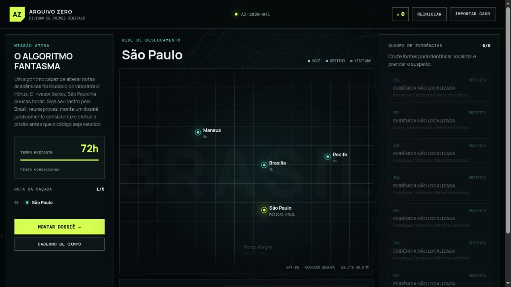
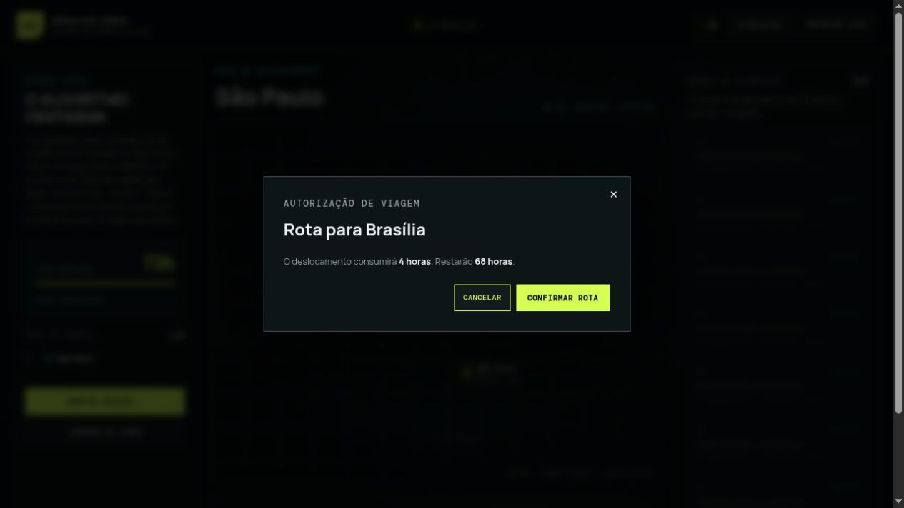
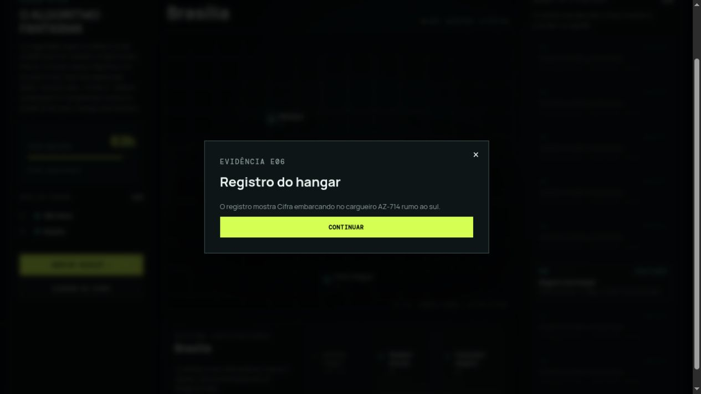
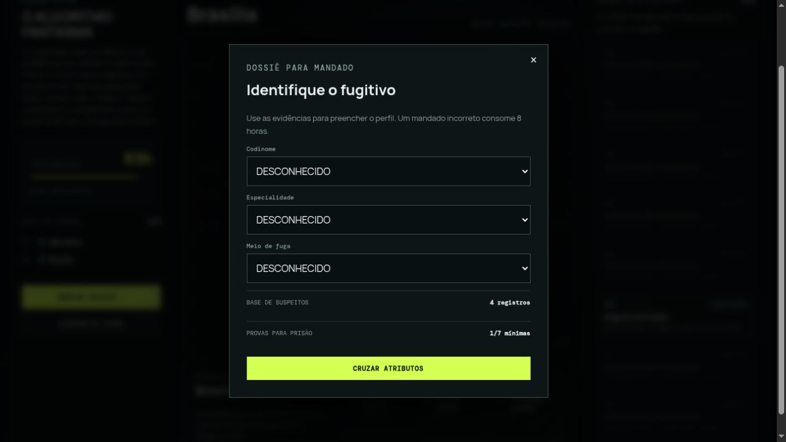
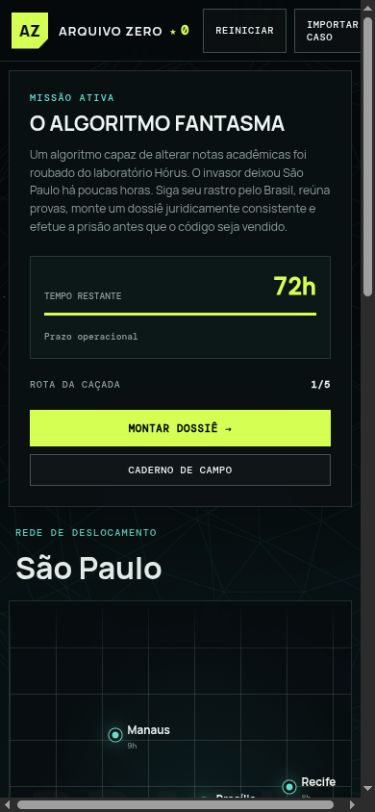

# Auditoria da interface gráfica — Arquivo Zero

**Tarefa ESAA:** `TITO-UI-AUDIT-001`  
**Data:** 13 de setembro de 2026  
**Modo:** auditoria combinada de UX e riscos de acessibilidade  
**Superfícies:** desktop 1265 × 712 e móvel 375 × 812  
**Resultado geral:** **boa base visual, com correções prioritárias para mobile,
teclado, alvos de toque e coerência do dossiê.**

## 1. Escopo

A auditoria percorreu a interface real servida localmente e cobriu:

1. estado inicial no desktop;
2. confirmação de viagem;
3. feedback após uma ação que revela evidência;
4. abertura do dossiê após uma evidência;
5. estado inicial em viewport móvel;
6. ordem básica de foco por teclado.

O objetivo do jogador considerado foi: compreender o caso, escolher um destino,
avaliar o custo temporal, coletar provas e montar um dossiê sem perder a noção do
prazo e da progressão.

## 2. Etapas observadas

### Etapa 1 — Estado inicial no desktop: saudável

O layout em três colunas estabelece uma hierarquia forte: missão e prazo à
esquerda, mapa como área principal e evidências à direita. O relógio e o botão
“Montar dossiê” são fáceis de localizar. A diferenciação visual de cidade atual,
destinos e local indisponível é compreensível também pelos textos associados.

Riscos observados:

- custos e rótulos do mapa usam texto muito pequeno;
- os pontos clicáveis das cidades parecem ter aproximadamente o tamanho do nó
  visual, abaixo de um alvo confortável para toque ou baixa precisão motora;
- oito cartões bloqueados e visualmente idênticos ocupam muito espaço antes de
  oferecer informação útil;
- o conteúdo bloqueado usa opacidade muito baixa, criando risco de contraste.

**Funções relacionadas:** `FN-007`, `FN-008`, `FN-009`, `FN-011`, `FN-012`,
`CB-004`, `CB-005`, `CB-006`, `CB-008`, `CB-012`.

### Etapa 2 — Confirmação de viagem: saudável

O diálogo informa destino, custo e saldo de horas antes da confirmação. As ações
“Cancelar” e “Confirmar rota” têm hierarquia adequada, e o fundo desfocado mantém
o contexto sem competir com a decisão.

Riscos observados:

- o botão “×” é anunciado apenas como “×”, sem nome acessível “Fechar”;
- o alvo do “×” é visualmente pequeno;
- não há indicação textual de eventual consequência além do consumo de horas.

**Funções relacionadas:** `FN-013`, `CB-006`, `CB-014`, `FN-015`, `CB-027`,
`CB-028`.

### Etapa 3 — Evidência encontrada: saudável com oportunidade de contexto

O feedback é imediato, identifica a evidência como `E06`, apresenta título e
conteúdo em linguagem direta e oferece uma única próxima ação. Após fechar o
diálogo, a contagem passa para `1/8`, o cartão E06 é revelado e a ação realizada
fica marcada como concluída.

Riscos observados:

- o diálogo não informa explicitamente o novo saldo de horas nem o avanço
  agregado das provas;
- mudanças no relógio e no quadro de evidências não possuem região viva
  identificável para anúncio por tecnologia assistiva.

**Funções relacionadas:** `FN-014`, `FN-015`, `FN-004`, `FN-007`, `FN-011`,
`FN-021`, `CB-011`, `CB-012`, `CB-016`, `CB-023`.

### Etapa 4 — Dossiê: atenção

Os três campos possuem rótulos visíveis, usam controles nativos e o painel deixa
claro que há quatro suspeitos e apenas `1/7` provas mínimas. A estrutura é limpa e
escaneável.

Problemas relevantes:

- “Cruzar atributos” permanece visualmente dominante e habilitado com apenas uma
  das sete provas mínimas; isso incentiva uma decisão prematura;
- a interface afirma que “um mandado incorreto consome 8 horas”, mas o fluxo
  atual de `submitDossier` (`FN-017`) não chama `spend` (`FN-015`). A promessa
  apresentada ao jogador e a regra executada estão desalinhadas;
- “1/7 mínimas” comunica quantidade, mas não explica que também existem
  evidências essenciais obrigatórias;
- o botão “×” repete o problema de nome acessível e tamanho de alvo.

**Funções relacionadas:** `FN-016`, `FN-017`, `FN-015`, `FN-021`, `CB-017`–
`CB-022`, `CB-025`, `CB-027`, `CB-028`.

### Etapa 5 — Estado inicial móvel: requer correção

Os painéis passam para uma sequência vertical e a missão, o relógio e as ações
principais continuam legíveis. Entretanto, a captura em 375 × 812 comprova
rolagem horizontal: há uma barra na base e parte do mapa fica fora da viewport.
O cabeçalho também fica comprimido, com “Importar caso” quebrando em duas linhas.

O problema prejudica leitura, toque e orientação espacial. A causa visual provável
é a soma das larguras mínimas do cabeçalho e/ou de elementos internos, apesar do
`display:block` aplicado ao grid principal no breakpoint móvel. Ocultar o overflow
não é correção suficiente; é necessário remover a largura excedente e validar que
todo o fluxo cabe em 320, 375 e 390 px.

**Funções relacionadas:** `FN-009`, `CB-004`, `CB-008`; a correção principal
provavelmente estará em `dist/styles.css` e na estrutura de `dist/index.html`.

### Etapa 6 — Navegação por teclado: atenção

O foco percorreu, nesta ordem, a marca, “Reiniciar”, “Montar dossiê”, “Caderno de
campo” e as cidades disponíveis. Os botões principais e destinos são alcançáveis.

Problemas relevantes:

- “Importar caso” foi ignorado pela ordem de foco porque o `input` está com
  `display:none` e o `label` não é focalizável;
- o CSS não define `:focus-visible`; há estilos de `hover`, mas nenhuma indicação
  de foco projetada para o tema;
- o `textarea` remove o contorno com `outline:0`, sem substituição de foco;
- não foi possível afirmar, apenas por esse teste, compatibilidade completa com
  leitores de tela.

**Funções relacionadas:** `FN-001`, `CB-025`–`CB-031`; correções estruturais
também atingiriam `dist/index.html` e `dist/styles.css`.

## 3. Pontos fortes

- identidade visual consistente e adequada ao tema investigativo;
- hierarquia desktop clara e bom destaque para prazo e ação principal;
- custos de viagem visíveis antes da decisão;
- diálogos nativos movem o foco para o contexto ativo;
- cidades e ações são botões HTML, em vez de interações presas ao canvas;
- canvas Three.js está marcado como decorativo no HTML;
- feedback de ação concluída, contagem de provas e rota é persistente.

## 4. Riscos priorizados

| Prioridade | Achado | Evidência | Impacto funcional provável |
| --- | --- | --- | --- |
| P1 | Rolagem horizontal e mapa excedendo a viewport móvel | Etapa 5 | `FN-009`, `CB-004`, `CB-008`, HTML e CSS |
| P1 | Importação de caso inacessível por teclado | Etapa 6 | `CB-031`, HTML e CSS |
| P1 | Texto promete penalidade de 8h, mas o dossiê não a executa | Etapa 4 + fluxo atual | `FN-017`, `FN-015`, `FN-004`, `FN-007` |
| P1 | Ausência de foco visível projetado; `textarea` sem outline substituto | Etapa 6 | CSS, `CB-025`–`CB-031` |
| P2 | Nós de cidades e botões “×” com alvo pequeno | Etapas 1–4 | `FN-009`, `CB-004`, `CB-027`, `CB-028`, HTML e CSS |
| P2 | Texto reduzido e contraste fraco nas evidências bloqueadas | Etapa 1 | `FN-011`, `CB-012`, CSS |
| P2 | CTA do dossiê incentiva tentativa com prova insuficiente | Etapa 4 | `FN-016`, `FN-017`, `CB-017`–`CB-022` |
| P2 | Atualizações de tempo e provas sem anúncio explícito | Etapa 3 | `FN-007`, `FN-008`, `FN-011`, HTML |
| P3 | Lista inicial de oito evidências repetidas aumenta ruído | Etapa 1 | `FN-011`, `CB-012`, CSS |
| P3 | Movimento contínuo sem tratamento observado de redução de movimento | Etapas 1 e 5 | `FN-025`, `FN-026`, `CB-032` |

## 5. Recomendações

1. **Corrigir primeiro a largura móvel.** Ajustar as larguras mínimas do cabeçalho
   e do mapa, usar `minmax(0, 1fr)` onde necessário e validar 320/375/390 px sem
   barra horizontal.
2. **Restabelecer acesso por teclado.** Tornar a importação focalizável, criar um
   estilo global `:focus-visible` de alto contraste e dar foco equivalente ao
   caderno.
3. **Resolver a regra contraditória do dossiê.** Escolher entre cobrar realmente
   8h ou remover a promessa; a decisão deve gerar tarefa ESAA e atualizar o mapa
   das funções impactadas.
4. **Aumentar os alvos de interação.** Criar uma área clicável maior ao redor dos
   nós das cidades e dos botões de fechamento, sem alterar a posição visual.
5. **Explicar prontidão probatória.** Diferenciar quantidade mínima de presença
   das evidências essenciais e considerar desabilitar ou contextualizar o CTA
   antes de uma base investigativa suficiente.
6. **Melhorar legibilidade e feedback assistivo.** Aumentar textos abaixo de
   aproximadamente 10 px, elevar o contraste dos estados bloqueados e avaliar
   `aria-live` para tempo, provas e resultados.
7. **Respeitar redução de movimento.** Pausar ou simplificar a cena Three.js com
   `prefers-reduced-motion`.

## 6. Limites da evidência

- As capturas comprovam aparência, reflow e os estados percorridos nesta execução;
  não comprovam conformidade WCAG completa.
- O teste de teclado cobriu a ordem básica de foco, mas não substitui NVDA, Orca,
  VoiceOver ou uma auditoria semântica automatizada.
- Contraste não foi medido com ferramenta colorimétrica; os apontamentos de
  contraste são riscos visuais que exigem medição antes de declarar falha WCAG.
- Não foram testados zoom de 200%/400%, orientação paisagem, telas de 320 px,
  diferentes navegadores ou o fluxo completo até prisão e derrota.
- Nenhum arquivo em `dist/` foi alterado durante a auditoria.
